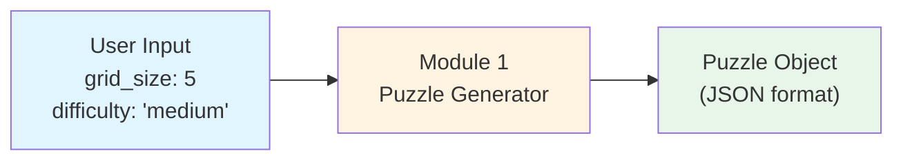
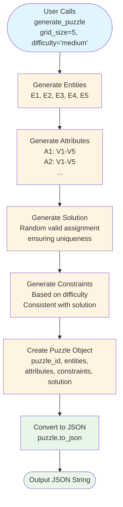

# Module 1: Data Flow Visualization

This document visualizes how data flows through Module 1 (Puzzle Generator).

## Data Flow Diagram



## Detailed Data Flow



## Input Structure

**Function Call:**
```python
generate_puzzle(grid_size=5, difficulty="medium")
```

**Input Parameters:**
- `grid_size` (int): Number of entities/attributes/values (e.g., 5)
- `difficulty` (str): "easy", "medium", or "hard"

## Output Structure

**Puzzle Object Structure:**
```
Puzzle
├── puzzle_id: "puzzle_<uuid>"
├── entities: ["E1", "E2", "E3", "E4", "E5"]
├── attributes: {
│     "A1": ["V1", "V2", "V3", "V4", "V5"],
│     "A2": ["V1", "V2", "V3", "V4", "V5"],
│     ...
│   }
├── constraints: [
│     Constraint(type="equality", entity="E1", attribute="A1", value="V3"),
│     Constraint(type="inequality", entity="E2", attribute="A1", value="V1"),
│     ...
│   ]
└── solution: {
│     "E1": {"A1": "V3", "A2": "V1", ...},
│     "E2": {"A1": "V1", "A2": "V4", ...},
│     ...
│   }
```

## Example: Complete Data Flow

### Input
```python
grid_size = 5
difficulty = "medium"
```

### Step 1: Generate Entities
```python
entities = ["E1", "E2", "E3", "E4", "E5"]
```

### Step 2: Generate Attributes
```python
attributes = {
    "A1": ["V1", "V2", "V3", "V4", "V5"],
    "A2": ["V1", "V2", "V3", "V4", "V5"],
    "A3": ["V1", "V2", "V3", "V4", "V5"],
    "A4": ["V1", "V2", "V3", "V4", "V5"],
    "A5": ["V1", "V2", "V3", "V4", "V5"]
}
```

### Step 3: Generate Solution
```python
solution = {
    "E1": {"A1": "V3", "A2": "V1", "A3": "V5", "A4": "V2", "A5": "V4"},
    "E2": {"A1": "V1", "A2": "V4", "A3": "V2", "A4": "V5", "A5": "V3"},
    "E3": {"A1": "V5", "A2": "V2", "A3": "V4", "A4": "V1", "A5": "V1"},
    "E4": {"A1": "V2", "A2": "V5", "A3": "V1", "A4": "V3", "A5": "V2"},
    "E5": {"A1": "V4", "A2": "V3", "A3": "V3", "A4": "V4", "A5": "V5"}
}
```

### Step 4: Generate Constraints (medium difficulty = ~13 constraints)
```python
constraints = [
    {"type": "equality", "entity": "E1", "attribute": "A1", "value": "V3"},
    {"type": "inequality", "entity": "E2", "attribute": "A1", "value": "V1"},
    {"type": "different_values", "entities": ["E1", "E2"], "attribute": "A2"},
    {"type": "relative_position", "entity1": "E3", "entity2": "E4", "attribute": "A3", "offset": 1},
    ...
]
```

### Step 5: Output JSON
```json
{
  "puzzle_id": "puzzle_550e8400-e29b-41d4-a716-446655440000",
  "entities": ["E1", "E2", "E3", "E4", "E5"],
  "attributes": {
    "A1": ["V1", "V2", "V3", "V4", "V5"],
    "A2": ["V1", "V2", "V3", "V4", "V5"],
    "A3": ["V1", "V2", "V3", "V4", "V5"],
    "A4": ["V1", "V2", "V3", "V4", "V5"],
    "A5": ["V1", "V2", "V3", "V4", "V5"]
  },
  "constraints": [
    {
      "type": "equality",
      "entity": "E1",
      "attribute": "A1",
      "value": "V3"
    },
    {
      "type": "inequality",
      "entity": "E2",
      "attribute": "A1",
      "value": "V1"
    },
    {
      "type": "different_values",
      "entities": ["E1", "E2"],
      "attribute": "A2"
    }
  ],
  "solution": {
    "E1": {"A1": "V3", "A2": "V1", "A3": "V5", "A4": "V2", "A5": "V4"},
    "E2": {"A1": "V1", "A2": "V4", "A3": "V2", "A4": "V5", "A5": "V3"},
    "E3": {"A1": "V5", "A2": "V2", "A3": "V4", "A4": "V1", "A5": "V1"},
    "E4": {"A1": "V2", "A2": "V5", "A3": "V1", "A4": "V3", "A5": "V2"},
    "E5": {"A1": "V4", "A2": "V3", "A3": "V3", "A4": "V4", "A5": "V5"}
  }
}
```

## Key Transformations

### Transformation 1: grid_size → Entities
```
Input: grid_size = 5
Process: Generate E1, E2, E3, E4, E5
Output: ["E1", "E2", "E3", "E4", "E5"]
```

### Transformation 2: grid_size → Attributes
```
Input: grid_size = 5
Process: Create A1-A5, each with values V1-V5
Output: {
  "A1": ["V1", "V2", "V3", "V4", "V5"],
  "A2": ["V1", "V2", "V3", "V4", "V5"],
  ...
}
```

### Transformation 3: difficulty → Constraint Count
```
Input: difficulty = "medium", grid_size = 5
Process: Calculate grid_size × 2.5 = 12.5 → round to 13
Output: 13 constraints generated
```

### Transformation 4: Solution → Constraints
```
Input: Valid solution (ensures uniqueness)
Process: Generate constraints consistent with solution
Output: List of constraints that the solution satisfies
```

## Data Flow Summary

1. **Input**: Simple parameters (grid_size, difficulty)
2. **Processing**: 
   - Generate structure (entities, attributes)
   - Create valid solution
   - Generate constraints based on difficulty
3. **Output**: Complete puzzle with all components in JSON format

The output from Module 1 becomes the input for Module 2 (excluding the hidden solution).
