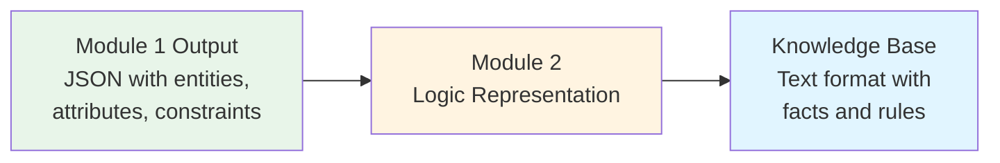
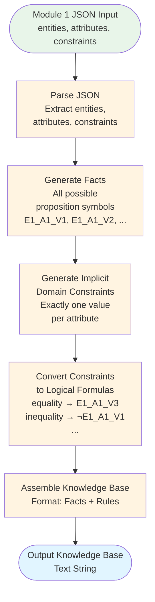

# Module 2: Data Flow Visualization

This document visualizes how data flows through Module 2 (Logic Representation).

## Data Flow Diagram



## Detailed Data Flow



## Input Structure

**Input from Module 1:**
```json
{
  "entities": ["E1", "E2", "E3"],
  "attributes": {
    "A1": ["V1", "V2", "V3"],
    "A2": ["V1", "V2", "V3"]
  },
  "constraints": [
    {
      "type": "equality",
      "entity": "E1",
      "attribute": "A1",
      "value": "V3"
    },
    {
      "type": "inequality",
      "entity": "E2",
      "attribute": "A1",
      "value": "V1"
    }
  ]
}
```

**Note:** Module 2 does NOT receive the `solution` field - only the puzzle structure.

## Output Structure

**Knowledge Base Text Format:**
```
=== KNOWLEDGE BASE ===

FACTS (All possible propositions):
[list of all E_A_V combinations]

RULES (Domain Constraints):
[implicit constraints about one value per attribute]

RULES (Puzzle Constraints):
[converted constraint formulas]
```

## Example: Complete Data Flow

### Input (from Module 1)
```json
{
  "entities": ["E1", "E2"],
  "attributes": {
    "A1": ["V1", "V2"]
  },
  "constraints": [
    {
      "type": "equality",
      "entity": "E1",
      "attribute": "A1",
      "value": "V2"
    },
    {
      "type": "different_values",
      "entities": ["E1", "E2"],
      "attribute": "A1"
    }
  ]
}
```

### Step 1: Generate Facts (All Possible Propositions)
```python
facts = [
    "E1_A1_V1",  # E1 has V1 for A1
    "E1_A1_V2",  # E1 has V2 for A1
    "E2_A1_V1",  # E2 has V1 for A1
    "E2_A1_V2"   # E2 has V2 for A1
]
```

### Step 2: Generate Implicit Domain Constraints
```python
# For E1 and A1: must have exactly one value
implicit_constraints = [
    "(E1_A1_V1 ∨ E1_A1_V2) ∧ (¬(E1_A1_V1 ∧ E1_A1_V2))",
    "(E2_A1_V1 ∨ E2_A1_V2) ∧ (¬(E2_A1_V1 ∧ E2_A1_V2))"
]
```

### Step 3: Convert Constraints to Formulas
```python
# Constraint 1: equality
# Input: {"type": "equality", "entity": "E1", "attribute": "A1", "value": "V2"}
# Output: "E1_A1_V2"

# Constraint 2: different_values
# Input: {"type": "different_values", "entities": ["E1", "E2"], "attribute": "A1"}
# Output: "¬(E1_A1_V1 ↔ E2_A1_V1) ∧ ¬(E1_A1_V2 ↔ E2_A1_V2)"
```

### Step 4: Output Knowledge Base
```
=== KNOWLEDGE BASE ===

FACTS (All possible propositions):
E1_A1_V1, E1_A1_V2, E2_A1_V1, E2_A1_V2

RULES (Domain Constraints):
1. (E1_A1_V1 ∨ E1_A1_V2) ∧ (¬(E1_A1_V1 ∧ E1_A1_V2))
2. (E2_A1_V1 ∨ E2_A1_V2) ∧ (¬(E2_A1_V1 ∧ E2_A1_V2))

RULES (Puzzle Constraints):
1. E1_A1_V2
2. ¬(E1_A1_V1 ↔ E2_A1_V1) ∧ ¬(E1_A1_V2 ↔ E2_A1_V2)
```

## Constraint Transformation Examples

### Example 1: Equality Constraint
```
Input (Module 1 format):
{
  "type": "equality",
  "entity": "E1",
  "attribute": "A1",
  "value": "V3"
}

Transformation:
generate_proposition_symbol("E1", "A1", "V3") → "E1_A1_V3"

Output (Module 2 format):
E1_A1_V3
```

### Example 2: Inequality Constraint
```
Input (Module 1 format):
{
  "type": "inequality",
  "entity": "E2",
  "attribute": "A1",
  "value": "V1"
}

Transformation:
1. generate_proposition_symbol("E2", "A1", "V1") → "E2_A1_V1"
2. Add negation: ¬E2_A1_V1

Output (Module 2 format):
¬E2_A1_V1
```

### Example 3: Different Values Constraint
```
Input (Module 1 format):
{
  "type": "different_values",
  "entities": ["E1", "E2"],
  "attribute": "A1"
}

Transformation:
For each value V in [V1, V2, V3]:
  Create: ¬(E1_A1_V ↔ E2_A1_V)
Combine with AND: ¬(E1_A1_V1 ↔ E2_A1_V1) ∧ ¬(E1_A1_V2 ↔ E2_A1_V2) ∧ ¬(E1_A1_V3 ↔ E2_A1_V3)

Output (Module 2 format):
¬(E1_A1_V1 ↔ E2_A1_V1) ∧ ¬(E1_A1_V2 ↔ E2_A1_V2) ∧ ¬(E1_A1_V3 ↔ E2_A1_V3)
```

### Example 4: Same Value Constraint
```
Input (Module 1 format):
{
  "type": "same_value",
  "entities": ["E1", "E2"],
  "attribute": "A1"
}

Transformation:
For each value V in [V1, V2, V3]:
  Create: (E1_A1_V ↔ E2_A1_V)
Combine with OR: (E1_A1_V1 ↔ E2_A1_V1) ∨ (E1_A1_V2 ↔ E2_A1_V2) ∨ (E1_A1_V3 ↔ E2_A1_V3)

Output (Module 2 format):
(E1_A1_V1 ↔ E2_A1_V1) ∨ (E1_A1_V2 ↔ E2_A1_V2) ∨ (E1_A1_V3 ↔ E2_A1_V3)
```

### Example 5: Relative Position Constraint
```
Input (Module 1 format):
{
  "type": "relative_position",
  "entity1": "E1",
  "entity2": "E2",
  "attribute": "A1",
  "offset": 1
}

Transformation:
For each valid pair where E1's value = E2's value + 1:
  (E1_A1_V2 ∧ E2_A1_V1)  # E1 has V2, E2 has V1 (offset = 1)
  (E1_A1_V3 ∧ E2_A1_V2)  # E1 has V3, E2 has V2 (offset = 1)
Combine with OR

Output (Module 2 format):
(E1_A1_V2 ∧ E2_A1_V1) ∨ (E1_A1_V3 ∧ E2_A1_V2)
```

## Data Flow Summary

1. **Input**: JSON from Module 1 (entities, attributes, constraints)
2. **Processing**:
   - Generate all possible proposition symbols (facts)
   - Create implicit domain constraints (exactly one value per attribute)
   - Convert each constraint to a logical formula
   - Assemble into formatted knowledge base
3. **Output**: Text knowledge base with facts and rules

The output from Module 2 becomes the input for Module 3 (Puzzle Solving).

## Key Transformations

### Transformation 1: Entities + Attributes + Values → Facts
```
Input: entities=["E1","E2"], attributes={"A1":["V1","V2"]}
Process: Generate all combinations
Output: ["E1_A1_V1", "E1_A1_V2", "E2_A1_V1", "E2_A1_V2"]
```

### Transformation 2: Constraint Object → Logical Formula
```
Input: {"type": "equality", "entity": "E1", "attribute": "A1", "value": "V3"}
Process: constraint_to_formula()
Output: "E1_A1_V3"
```

### Transformation 3: Multiple Constraints → Knowledge Base
```
Input: List of constraint objects
Process: Convert each to formula, format with rules
Output: Structured text knowledge base
```
