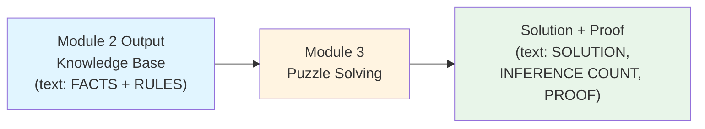
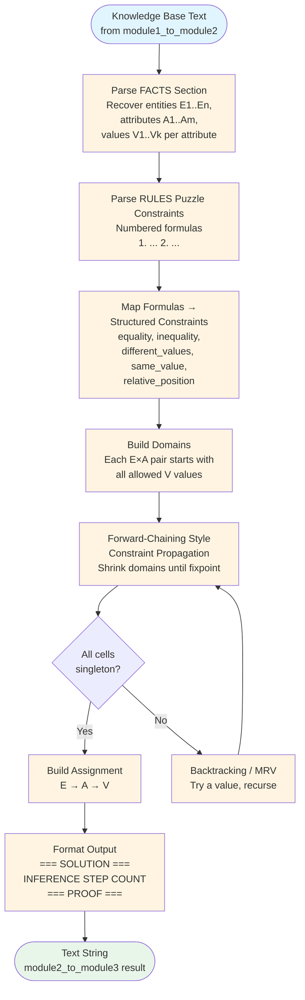
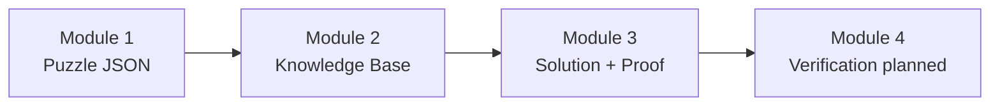

# Module 3: Data Flow Visualization

This document visualizes how data flows through **Module 3 (Puzzle Solving)**—the solver that reads Module 2’s knowledge base and produces a full assignment plus an inference proof.

## Data Flow Diagram



## Detailed Data Flow



## Input Structure

**Primary entry point (Python):**
```python
from module3_puzzle_solving import module2_to_module3

kb_text = module1_to_module2(puzzle_dict)  # or read KB string from file
result = module2_to_module3(kb_text)
```

**Input:** One string containing Module 2’s knowledge base with these **required sections** (markers must appear as produced by Module 2):

| Section | Marker | Role for Module 3 |
|--------|--------|-------------------|
| Facts | `FACTS (All possible propositions):` | Recover `E*`, `A*`, and allowed `V*` lists |
| Domain rules | `RULES (Domain Constraints):` | Delimits end of facts blob (not re-parsed as logic in current solver) |
| Puzzle rules | `RULES (Puzzle Constraints):` | Numbered lines `1. <formula>` … drive solving |

**CLI (optional):**
```bash
python src/module3_puzzle_solving.py path/to/knowledge_base.txt
# or pipe KB text on stdin
```

## Output Structure

**Text layout (conceptual):**
```
=== SOLUTION ===
E1: A1=V2, A2=V1, ...
E2: A1=V1, A2=V2, ...

INFERENCE STEP COUNT: <n>

=== PROOF ===
1. [deduction] ...
2. [decision] ...
...
```

- **`=== SOLUTION ===`** — One line per entity; each line lists `Ai=Vj` pairs for every attribute.
- **`INFERENCE STEP COUNT:`** — Number of proof lines (deductions + decisions).
- **`=== PROOF ===`** — Numbered steps:
  - **`[deduction]`** — Forced by rules (domain narrowed / equality / propagation).
  - **`[decision]`** — Search choice when propagation alone does not fix all cells (backtracking).

## Example: Complete Data Flow (Tiny Puzzle)

### Input (fragment of Module 2 knowledge base)

```
=== KNOWLEDGE BASE ===

FACTS (All possible propositions):
E1_A1_V1, E1_A1_V2, E2_A1_V1, E2_A1_V2

RULES (Domain Constraints):
1. (E1_A1_V1 ∨ E1_A1_V2) ∧ ...
2. (E2_A1_V1 ∨ E2_A1_V2) ∧ ...

RULES (Puzzle Constraints):
1. E1_A1_V2
2. ¬(E1_A1_V1 ↔ E2_A1_V1) ∧ ¬(E1_A1_V2 ↔ E2_A1_V2)
```

### Step 1: Recover structure from FACTS
```python
entities = ["E1", "E2"]
attributes = {"A1": ["V1", "V2"]}
```

### Step 2: Parse puzzle formulas into constraints
```text
1. equality      → E1 must have A1 = V2
2. different_values → E1 and E2 differ on A1
```

### Step 3: Domains after propagation (illustrative)
```text
(E1, A1): {V2}          # forced by equality
(E2, A1): {V1}          # cannot be V2 if different from E1
```

### Step 4: Output (illustrative)
```
=== SOLUTION ===
E1: A1=V2
E2: A1=V1

INFERENCE STEP COUNT: 2

=== PROOF ===
1. [deduction] E1 A1 must be V2
2. [deduction] E2 A1 becomes V1
```

*(Exact proof lines depend on run order and whether backtracking was used.)*

## Key Transformations

### Transformation 1: FACTS text → Entities & attributes
```
Input: Comma-separated proposition symbols in FACTS section
Process: Regex-parse E*_A*_V* tokens; group by entity and attribute numbers
Output: entities list + attributes dict (A → [V1, V2, ...])
```

### Transformation 2: Puzzle rule lines → ParsedConstraint objects
```
Input: "1. E1_A1_V3" or compound formulas with ∧, ∨, ¬, ↔
Process: Pattern match Module 2’s formula shapes
Output: equality | inequality | different_values | same_value | relative_position | contradiction
```

### Transformation 3: Domains + constraints → Assignment
```
Input: Full domain per (entity, attribute); list of parsed constraints
Process: Repeatedly apply constraint handlers until no change; backtrack if needed
Output: Dict E → {A → V} satisfying all puzzle constraints
```

### Transformation 4: Assignment + proof log → Final string
```
Input: assignment dict; list of proof step strings
Process: Sort entities/attributes for stable display; number proof lines
Output: Single text block for Module 4 / demos
```

## Pipeline Position



## Data Flow Summary

1. **Input**: Module 2 knowledge base **text** (facts + puzzle constraint formulas).
2. **Processing**:
   - Parse structure from FACTS.
   - Parse and interpret puzzle rules.
   - Maintain domains per cell; propagate constraints (forward-chaining style).
   - Use backtracking when propagation does not fully determine the grid.
3. **Output**: Human-readable **solution** plus **proof** and **inference step count**.

The output from Module 3 is intended as input for **Module 4** (solution verification) and later modules that consume proofs (e.g., explanations / difficulty metrics).
