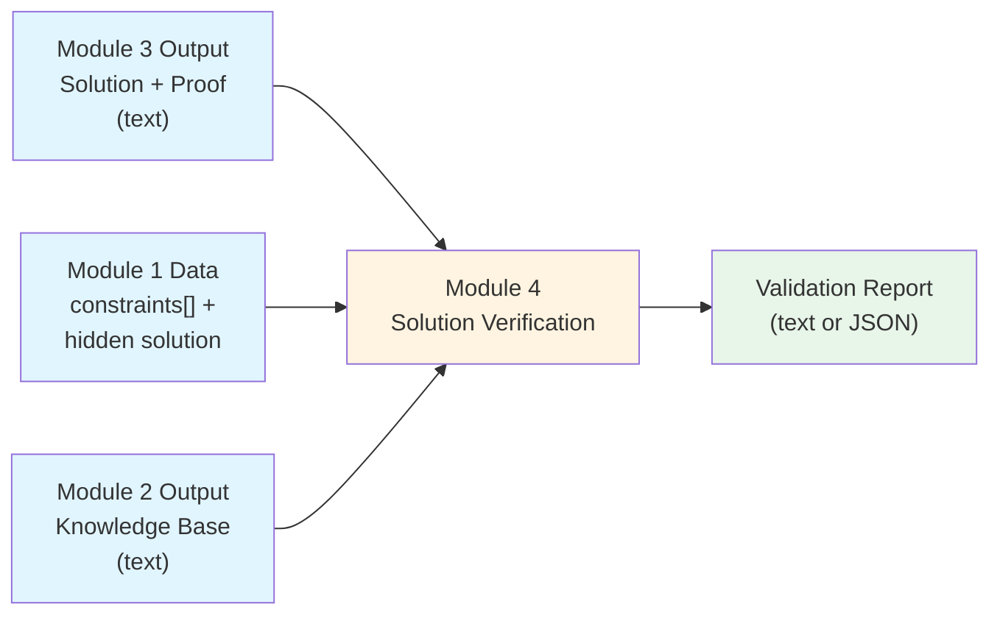
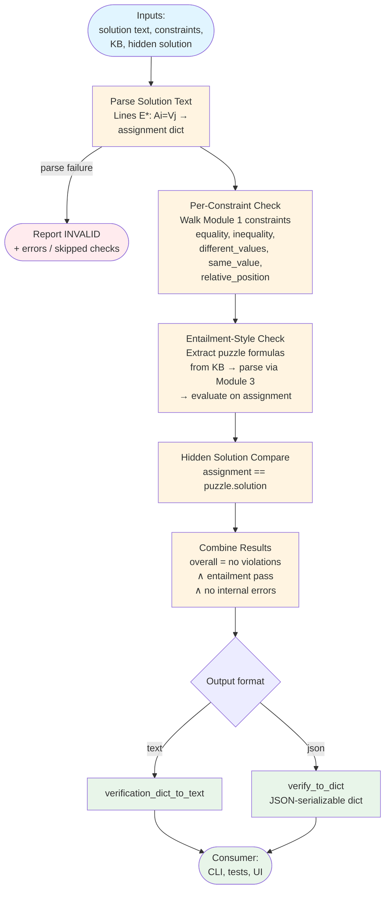
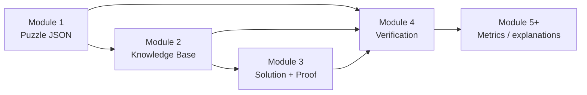

# Module 4: Data Flow Visualization

This document visualizes how data flows through **Module 4 (Solution Verification)**—the validator that checks a Module 3 solution against Module 1 constraints, Module 2 puzzle formulas, and the hidden Module 1 solution.

## Data Flow Diagram



## Detailed Data Flow



## Input Structure

**Primary entry points (Python):**

```python
from module4_solution_verification import (
    module3_to_module4,
    module1_2_3_to_module4,
    verify_to_dict,
    verification_dict_to_text,
)

# Full pipeline adapter (Module 1 dict + Module 2 KB + Module 3 text)
report_text = module1_2_3_to_module4(module3_output, puzzle_dict, kb_text)

# Lower-level: supply constraints and hidden solution explicitly
report_text = module3_to_module4(
    solution_text=module3_output,
    constraints_data=puzzle_dict["constraints"],
    knowledge_base=kb_text,
    hidden_solution=puzzle_dict["solution"],
)

# Structured API (e.g. for UI) — same logic, dict in / optional text out
report_dict = verify_to_dict(
    solution_text=module3_output,
    constraints_data=puzzle_dict["constraints"],
    knowledge_base=kb_text,
    hidden_solution=puzzle_dict["solution"],
)
text = verification_dict_to_text(report_dict)
```

| Input | Source | Role in Module 4 |
|--------|--------|------------------|
| Solution text | Module 3 (`module2_to_module3`) | Parsed into `E* → {A* → V*}` assignment |
| `constraints` | Module 1 puzzle JSON/dict | Each constraint checked against assignment (CSP-style) |
| Knowledge base | Module 2 (`module1_to_module2`) | Puzzle rule lines extracted; each formula re-parsed and evaluated on assignment |
| `solution` (hidden) | Module 1 puzzle JSON/dict | Exact dict equality vs parsed assignment (reference check) |

**Solution line shape expected by the parser:**

- Lines like `E1: A1=V3, A2=V1, ...` (entity label, colon, comma-separated `Ai=Vj` pairs).
- Lines that do not look like `E...:` assignments are skipped (headers such as `=== SOLUTION ===` are ignored).

**CLI (optional):**

```bash
python -m src.module4_solution_verification module3.txt puzzle.json kb.txt
python -m src.module4_solution_verification module3.txt puzzle.json kb.txt --format json
```

## Output Structure

### Text report (`module3_to_module4` / `module1_2_3_to_module4` / `--format text`)

Conceptual layout:

```
=== VALIDATION REPORT ===
OVERALL VALIDATION RESULT: VALID | INVALID

ERRORS:
- ...                    # only if internal errors (e.g. entailment exception)

PER-CONSTRAINT RESULTS:
1. [SATISFIED|VIOLATED] <type> - <detail>
...

LOGICAL ENTAILMENT CHECK: PASS | FAIL (<details>)
HIDDEN SOLUTION COMPARISON: MATCH | MISMATCH

VIOLATION SUMMARY:
None
# or numbered list of failed constraints
```

- **`OVERALL VALIDATION RESULT`** — `VALID` only if every constraint passes, entailment passes, and there are no recorded errors in the structured path.
- **`PER-CONSTRAINT RESULTS`** — One line per Module 1 constraint, in order.
- **`LOGICAL ENTAILMENT CHECK`** — Whether the assignment satisfies every extracted puzzle formula from the KB (parsed using Module 3’s constraint machinery).
- **`HIDDEN SOLUTION COMPARISON`** — Whether the parsed assignment equals Module 1’s `solution` dict exactly.
- **`VIOLATION SUMMARY`** — Subset of constraints that failed (or `None`).

### JSON report (`verify_to_dict` / `--format json`)

Top-level keys include:

- `overall_pass` (bool)
- `errors` (list of strings)
- `constraint_results` (list of per-constraint objects with `pass`, `details`, etc.)
- `violation_summary` (failed constraints only)
- `entailment` — `{ "pass": bool, "details": str }`
- `hidden_solution_match` — `{ "pass": bool, "details": str }`

## Example: Complete Data Flow (Tiny Puzzle)

### Inputs

**Module 3 (fragment):**

```
=== SOLUTION ===
E1: A1=V2
E2: A1=V1
```

**Module 1 constraints (conceptual):**

```json
[
  {"type": "equality", "entity": "E1", "attribute": "A1", "value": "V2"},
  {"type": "different_values", "entities": ["E1", "E2"], "attribute": "A1"}
]
```

**Module 1 hidden solution:**

```json
{
  "E1": {"A1": "V2"},
  "E2": {"A1": "V1"}
}
```

**Module 2 KB (fragment):** must contain `RULES (Puzzle Constraints):` with numbered formulas consistent with Module 1 (as produced by Module 2).

### Step 1: Parsed assignment

```text
{"E1": {"A1": "V2"}, "E2": {"A1": "V1"}}
```

### Step 2: Constraint checks

```text
1. equality E1.A1 == V2 → SATISFIED
2. different_values E1 vs E2 on A1 → SATISFIED
```

### Step 3: Entailment check

- Extract formulas from `RULES (Puzzle Constraints):`.
- Parse each with `_parse_puzzle_constraint` (shared with Module 3).
- Evaluate each on the assignment; all must succeed for `PASS`.

### Step 4: Hidden solution

```text
assignment == hidden_solution → MATCH
```

### Step 5: Sample output

```
=== VALIDATION REPORT ===
OVERALL VALIDATION RESULT: VALID
...
LOGICAL ENTAILMENT CHECK: PASS (All N puzzle formulas satisfied)
HIDDEN SOLUTION COMPARISON: MATCH
VIOLATION SUMMARY:
None
```

## Key Transformations

### Transformation 1: Solution text → Assignment dict

```
Input: Multi-line Module 3 output (only E*: lines contribute)
Process: Split on commas; parse Ai=Vj pairs per entity
Output: Dict[str, Dict[str, str]] or structured error in verify_to_dict
```

### Transformation 2: Module 1 constraint JSON → Pass/fail per row

```
Input: List of constraint dicts (same schema as Module 1 export)
Process: Dispatch by type; compare to assignment fields
Output: List of constraint_results + violation_summary
```

### Transformation 3: KB puzzle rules → Entailment check

```
Input: Full KB text
Process: _extract_puzzle_rule_formulas → _parse_puzzle_constraint (Module 3) → _evaluate_parsed_constraint
Output: (pass, detail string)
```

### Transformation 4: Structured report → Text

```
Input: verify_to_dict result
Process: verification_dict_to_text
Output: Single string for logging, files, or demos
```

## Pipeline Position



## Data Flow Summary

1. **Inputs**: Module 3 **text** (solution lines), Module 1 **constraints + hidden solution**, Module 2 **knowledge base** (for puzzle formulas).
2. **Processing**:
   - Parse the candidate assignment from Module 3 output.
   - Verify every Module 1 constraint against that assignment.
   - Re-check logical consistency by evaluating KB puzzle formulas on the same assignment.
   - Compare to the hidden solution for an exact-match audit line.
3. **Outputs**: A **validation report** (human-readable text and/or JSON) suitable for grading, demos, and downstream modules (e.g. difficulty or explanation pipelines).

The output from Module 4 confirms that the solved grid is both **constraint-valid** and **logically consistent** with the encoded puzzle before you rely on it in later analysis stages.
