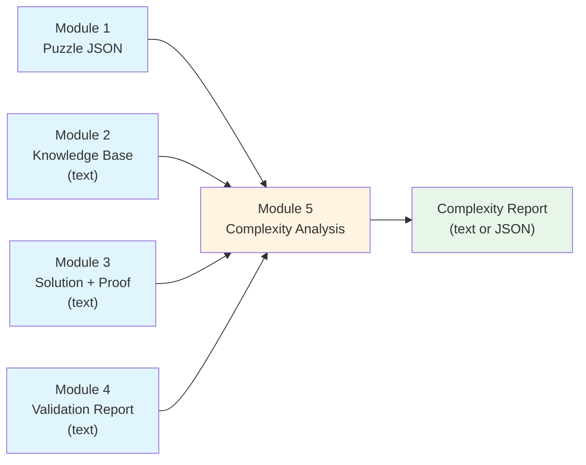
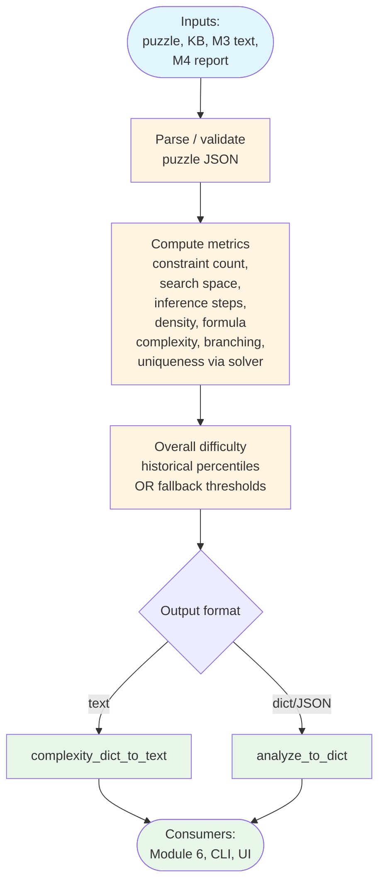

# Module 5: Data Flow Visualization

This document visualizes how data flows through **Module 5 (Complexity Analysis)**—the stage that turns puzzle structure, the knowledge base, solver output, and the Module 4 validation report into **explicit difficulty metrics** and an **overall difficulty score/label** (with optional historical percentile scoring).

## Data Flow Diagram



## Detailed Data Flow



## Primary entry points (Python)

```python
from module4_solution_verification import module1_2_3_to_module4
from module5_complexity_analysis import analyze_to_dict, module1_2_3_4_to_module5, complexity_dict_to_text

m4_text = module1_2_3_to_module4(module3_output, puzzle_dict, kb_text)

report_dict = analyze_to_dict(
    puzzle_structure=puzzle_dict,
    knowledge_base=kb_text,
    solution_proof_text=module3_output,
    validation_report_text=m4_text,
    historical_dataset=None,  # or list / JSON path for percentile scoring
)
text = complexity_dict_to_text(report_dict)

# One-shot text report (wraps analyze_to_dict + complexity_dict_to_text)
text = module1_2_3_4_to_module5(puzzle_dict, kb_text, module3_output, m4_text)
```

| Input | Source | Role in Module 5 |
|--------|--------|------------------|
| Puzzle structure | Module 1 | Entities, attributes, constraints → counts, density, search-space estimate |
| Knowledge base | Module 2 | Formula complexity (connectives in puzzle rules) |
| Solution + proof | Module 3 | Inference step count; proof regex / line patterns |
| Validation report | Module 4 | `VALID` / invalid flag; feeds `overall_pass` with uniqueness |

## Output shape (text report)

Conceptual layout:

```
=== COMPLEXITY ANALYSIS REPORT ===
OVERALL COMPLEXITY STATUS: PASS | CHECK
UPSTREAM VALIDATION PASS: True | False
OVERALL DIFFICULTY SCORE (0-100): ...
OVERALL DIFFICULTY LABEL: easy | medium | hard

METRICS:
- constraint_count: ...
  interpretation: ...
- search_space_size: ...
...
- solution_uniqueness: ...
```

## CLI

```bash
python -m src.module5_complexity_analysis puzzle.json kb.txt module3.txt module4.txt
python -m src.module5_complexity_analysis puzzle.json kb.txt module3.txt module4.txt --format json
# Optional: --historical_dataset_path metrics_baseline.json
```

## Downstream

- **Module 6** reads the **text** complexity report (opaque) to inform the “overall solution strategy” section alongside the Module 3 proof.
