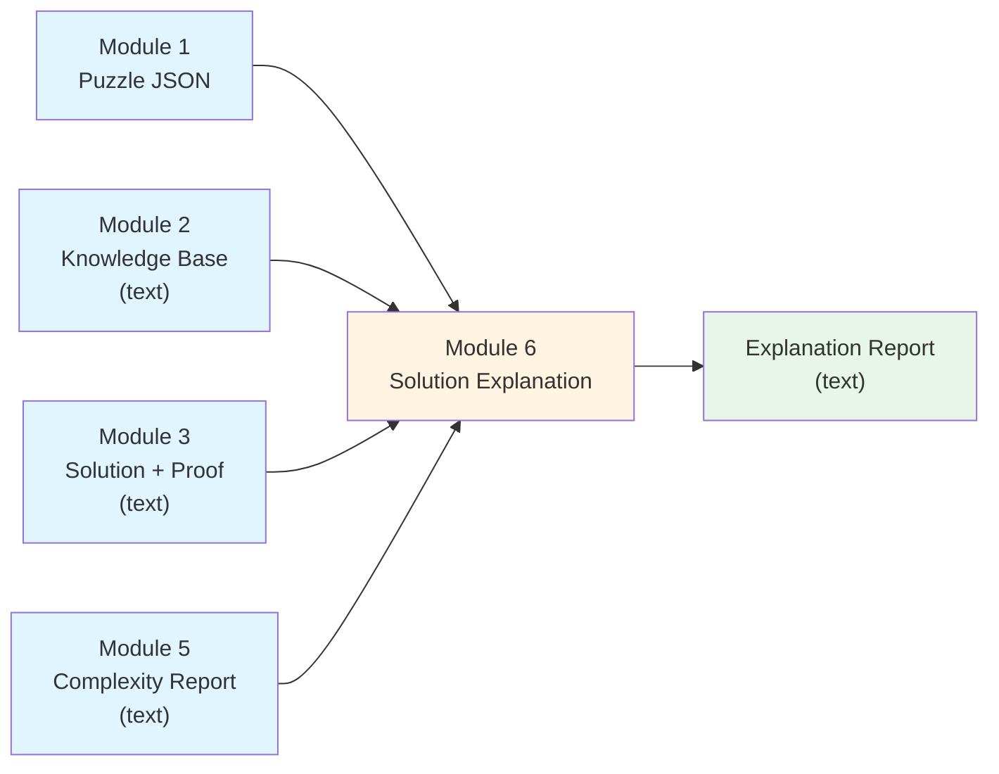
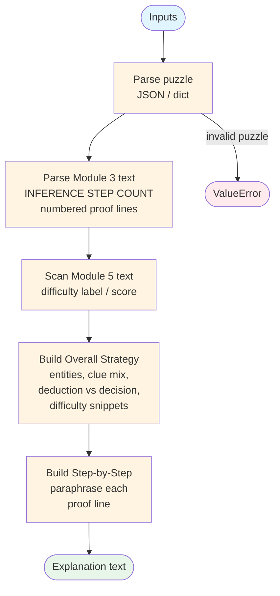

# Module 6: Data Flow Visualization

This document visualizes how data flows through **Module 6 (Solution Explanation)**—the stage that turns formal solver output and analysis artifacts into a **human-readable narrative** (overall strategy + step-by-step reasoning).

## Data Flow Diagram



> **Note:** Module 4 is not a direct input to Module 6 in the table-driven design; its effect is already reflected in Module 5’s report and in whether the upstream pipeline is consistent.

## Detailed Data Flow



## Primary entry point (Python)

```python
from module6_solution_explanation import module1_2_3_5_to_module6

explanation_text = module1_2_3_5_to_module6(
    puzzle_structure=puzzle_dict,       # dict or JSON string
    knowledge_base=kb_text,
    solution_proof_text=module3_output,
    complexity_report_text=module5_text,
)
```

| Input | Source | Role in Module 6 |
|--------|--------|------------------|
| Puzzle structure | Module 1 | Entity/attribute counts; summarize constraint **types** for strategy |
| Knowledge base | Module 2 | Confirms standard KB markers; narrative about facts + rules |
| Solution + proof | Module 3 | Parsed proof lines (`[deduction]`, `[decision]`) → step section |
| Complexity report | Module 5 | Difficulty score/label snippets → strategy section |

## Output shape (text report)

Conceptual layout:

```
=== SOLUTION EXPLANATION REPORT ===

=== OVERALL SOLUTION STRATEGY ===
<narrative paragraphs>

=== STEP-BY-STEP REASONING ===
### Step 1
**Propagation:** ...
### Step 2
**Search decision:** ...
...
```

## CLI

```bash
python -m src.module6_solution_explanation puzzle.json kb.txt module3.txt module5_report.txt
```

## Related docs

- Contract: [`module6_io_contract.md`](module6_io_contract.md)
- Easy explanation: [`MODULE_EXPLANATIONS.md`](MODULE_EXPLANATIONS.md) (Module 6 section)
